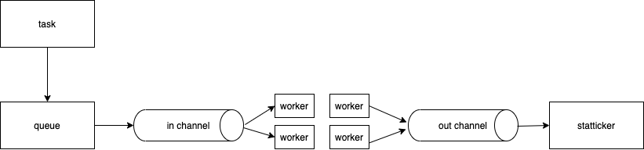

# gofaninfanout
goofing around with go - fan in and fan out with go routines and channels


## goals

The goal of this project is to just simulate a work queue.

For the work queue, it will simply add two numbers and set a result.  

It will have a random delay during the work process to simulate variable work.

There will be limited number of runners, use channels to send work.

Use wait group to keep track of completed work.

## how it works



## sample run

this is the tail end of a run

The individual worker goroutines will report some values, and the fan in goroutine will report the updated statistics.

```
2020/10/11 17:49:41 worker #2: {992 993 1985 2} 3942ms
2020/10/11 17:49:41 fan in: 997 202 4.935643564356436 1985 map[0:104 1:101 2:99 3:97 4:106 5:108 6:92 7:89 8:101 9:100]
2020/10/11 17:49:41 worker #6: {997 998 1995 6} 2546ms
2020/10/11 17:49:41 fan in: 998 202 4.9405940594059405 1995 map[0:104 1:101 2:99 3:97 4:106 5:108 6:93 7:89 8:101 9:100]
2020/10/11 17:49:41 worker #7: {999 1000 1999 7} 2755ms
2020/10/11 17:49:41 fan in: 999 202 4.945544554455446 1999 map[0:104 1:101 2:99 3:97 4:106 5:108 6:93 7:90 8:101 9:100]
2020/10/11 17:49:42 worker #3: {998 999 1997 3} 3315ms
2020/10/11 17:49:42 fan in: 1000 203 4.926108374384237 1997 map[0:104 1:101 2:99 3:98 4:106 5:108 6:93 7:90 8:101 9:100]
2020/10/11 17:49:42 time elapsed: 203s
2020/10/11 17:49:42 Program Ended
```